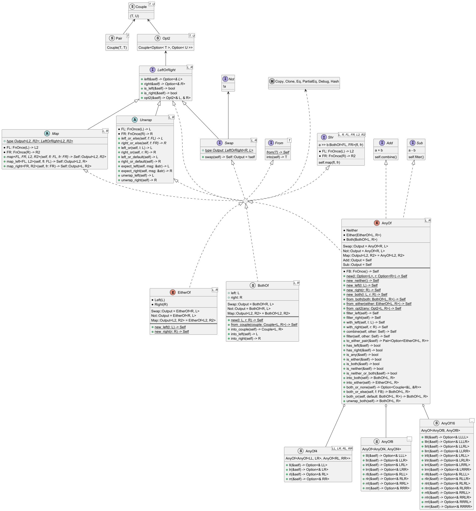

# AnyOf : a versatile type for Rust

[](https://github.com/Trehinos/any_of/actions/workflows/rust.yml)

This project implements a flexible [Algebraic Data Type](https://en.wikipedia.org/wiki/Algebraic_data_type) : `AnyOf`.

`AnyOf` is an optional **sum product of two types**,  
which enables clear and safe data representations in functional and type-driven programming.

## Overview

At the core of the project is the `AnyOf` enum, a general-purpose algebraic type,
alongside additional types as `EitherOf` and `BothOf`.

These abstractions allow to express dynamic states, optional values, and branching logic in a natural and explicit
manner.

### Key Types

1. **`AnyOf<L, R>`**
    - A flexible type that represents four possible states:
        - `Neither`: No value is present.
        - `Either`:
            - `Left`: Only the left value is present.
            - `Right`: Only the right value is present.
        - `Both`: Both values are present.
    - It combines variants in the following way:
      ```
      AnyOf<L, R> = Neither
                  | Either(EitherOf<L, R>)
                  | Both(BothOf<L, R>)
      ```
    - Its cases are:
      ```
      AnyOf(l: L, r: R) = Neither 
                        | Either(Left(l))
                        | Either(Right(r)) 
                        | Both(BothOf{left = l, right = r})
      ```
    - This type can also be viewed as a product of two optional types:
      ```
      AnyOf<L, R>::opt2() -> (Option<L>, Option<R>)
      ```
      Cases :
        - `Neither.opt2()` returns `(None, None)`
        - `Left(L).opt2()` returns `(Some(L), None)`
        - `Right(R).opt2()` returns `(None, Some(R))`
        - `Both(L, R).opt2()` returns `(Some(L), Some(R))`

2. **`EitherOf<L, R>`**
    - A simple sum type representing one of two values.
    - Variants:
        - `Left(L)`
        - `Right(R)`
    - Ideal for binary decision-making.
    - Implements `opt2()` too :
        - `Left(L).opt2()` returns `(Some(L), None)`
        - `Right(R).opt2()` returns `(None, Some(R))`
    - It is the type :
      ```
      EitherOf<L, R> = Left(L) | Right(R)
      ```

3. **`BothOf<L, R>`**
    - A product type that pairs two values, `left` and `right`, of potentially different types.
    - Implements `opt2()` too :
        - `BothOf{ left: L, right: R }.opt2()` returns `(Some(L), Some(R))`
    - It is the type:
      ```
      BothOf<L, R> = {left: L, right: R}
      ```
    - It can be transformed into a tuple with:  
      `into_couple(self) -> Couple<L, R>`,
    - And can be transformed from a tuple with:  
      `from_couple(Couple<L, R>) -> Self`,

4. **Enhanced Type Composition**
    - A `Couple<T, U>` is a `(T, U)`,
    - A `Pair<T>` is a `Couple<T, T>`,
    - An `Opt2<T, U>` is a `Couple<Option<T>, Option<U>>`,
    - Complex types like `AnyOf4`, `AnyOf8`, and `AnyOf16` are implemented for handling larger,
      structured combinations via nested `AnyOf` structures.
    - The `LeftOrRight` trait :
        - Provides the methods `is_right()`, `is_left()`, `opt2()`, `left()` and `right()`.
        - Implemented by `AnyOf`, `EitherOf` and `BothOf`,
        - Can be implemented by a custom type.
    - Other useful traits : `Unwrap<L, R>`, `Swap<L, R>` and `Map<L, R>`.

### Features and Utilities

- Methods inspired by Rust's `Option` and `Result` types:
    - Creation utilities: `new`, `new_left`, `new_both`, etc.
    - State checks: `is_neither`, `is_left`, `is_both`, etc.
    - Transformations: `map_left`, `map_right`, `swap`, etc.
    - Unwrapping: `unwrap_left`, `unwrap_right`, `unwrap_both`.

- Flexible combinations:
    - Operators :
        - `+` to **combine** `AnyOf` values, or,
        - `-` to **filter** `AnyOf` values, or,
        - `!` to **swap**  `AnyOf`, `EitherOf` and `BothOf` values,
        - `>>` to **map**  `AnyOf`, `EitherOf` and `BothOf` values,
    - Default value handling and state manipulation methods.



[Download the type diagram](doc/types.plantuml).

### Use Cases

`AnyOf` and its related types simplify dynamic state management and are well-suited for:

- Branching logic in functional programming.
- Handling optional or partial data.
- Implementing explicit and exhaustive handling of all potential states.
- Minimizing boilerplate for complex decision-making.

## Motivation

The project aims to enrich Rust's type system with expressive and flexible types
for representing data combinations and states.  
It is inspired by the Haskel's `Either` type.

* Unlike the Rust's `Result` type, the types `AnyOf`, `EitherOf` or `LeftOrRight` have not an "error" semantic, they are
  general purpose,
* `LeftOrRight<L, R>::opt2()` returns a `(Option<L>, Option<R>)`  which is a product of two optional
  types, but the two types have different composition conciseness :
  ```
  AnyOf<AnyOf<LL, LR>, AnyOf<RL, RR>>
  vs
  (Option<(Option<LL>, Option<LR>)>, Option<(Option<RL>, Option<RR>)>)
  
  AnyOf<AnyOf<AnyOf<LLL, LLR>, AnyOf<LRL, LRR>>, AnyOf<AnyOf<RLL, RLR>, AnyOf<RRL, RRR>>>
  vs
  (Option<(Option<(Option<LLL>, Option<LLR>)>, Option<(Option<LRL>, Option<LRR>)>)>, Option<(Option<(Option<RLL>, Option<RLR>)>, Option<(Option<RRL>, Option<RRR>)>)>)
  ```

## Status

The library may evolve following **semantic versioning**,
so the API will be stable in a given major version.

[Feedback is welcome](mailto:dev-any-of@trehinos.eu)!

## License

&copy; 2025 Sébastien Geldreich  
Distributed under the MIT License.